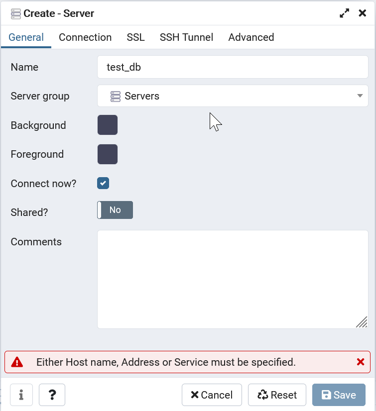
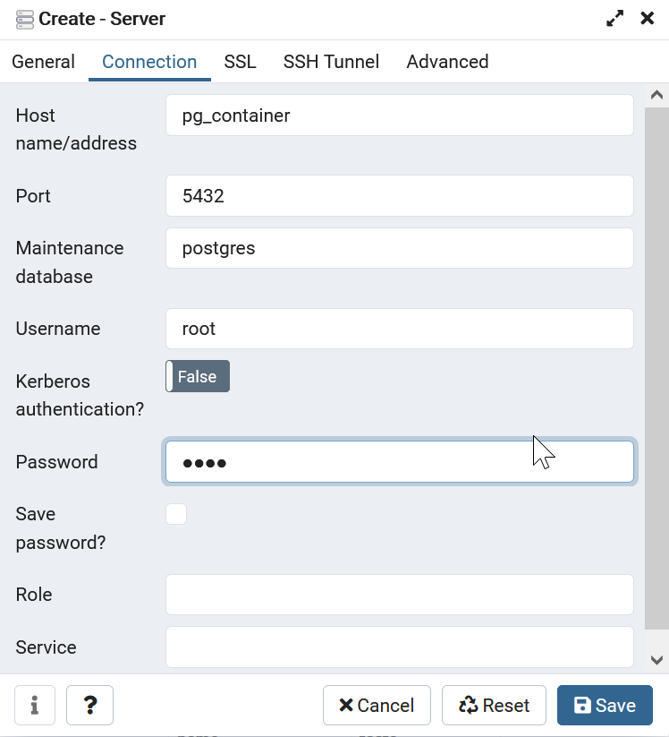
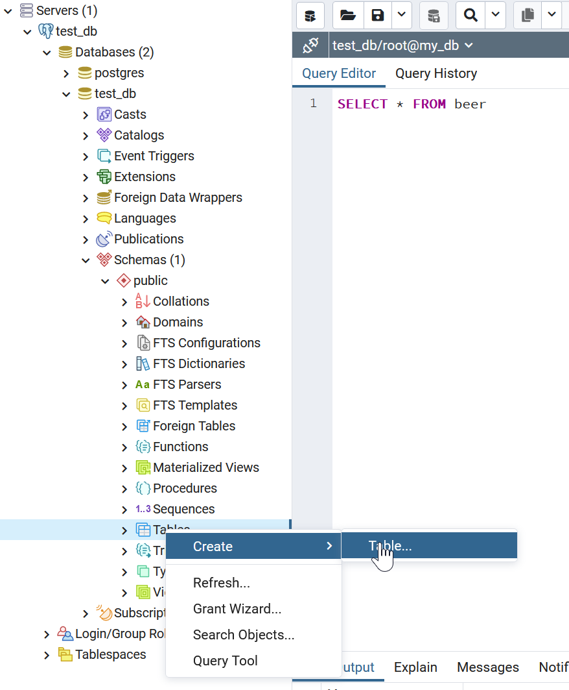
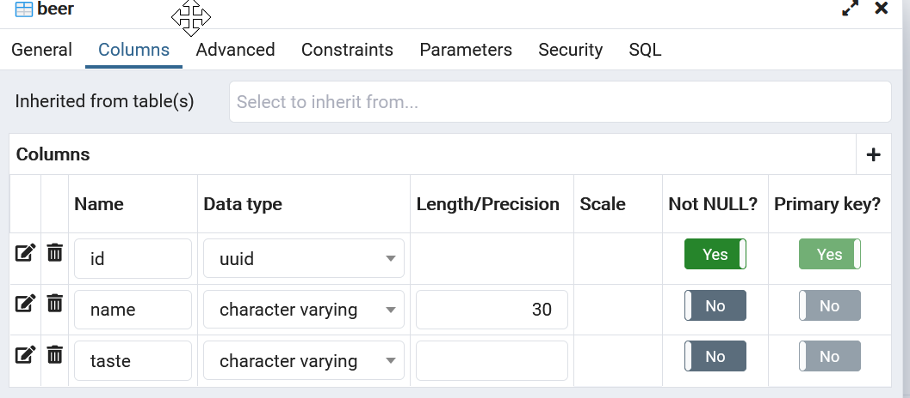

## Requirements

* You need Docker installed on your system (https://www.docker.com/)
* PostgreSQL and the Administration Tool is both deployed inside a docker container so you dont need to install PostgreSQL

## Running

* Start PostgreSQL and PgAdmin

```shell
docker compose up
```

### Setup the database 

* Visit `localhost:5050` in your browser
* Login into PgAdmin with `admin@admin.com` and `root` as password
* Connect to the postgres server by right clicking on servers and create
* Fill out the form: (Password for the Database is also root)




* Open the databases tree structure and open the test_db
* Open schemas and right click on `Tables` and Create



* Fill out the form
  * name: beer
  * Columns: Click on the + to add a new column



* Create the table 
* Open the dropdown of the tables, open beer and columns
* Right click on "id" and select properties
* Switch to the constraints tab and paste the following into the default `gen_random_uuid()` and click save

* The database should be setup and you can start the API

### Start the API 

```shell
node src/beer-api.js
```

## Backup & Restore Database

Docker Container Id

```shell
docker container ls
```

Backup Database (Dump)

```shell
docker exec -t your-db-container pg_dumpall -c -U your-db-user | gzip > ./dump_$(date +"%Y-%m-%d_%H_%M_%S").gz
```

Apply Backup 

```shell
gunzip < your_dump.sql.gz | docker exec -i your-db-container psql -U your-db-user -d your-db-name
```

